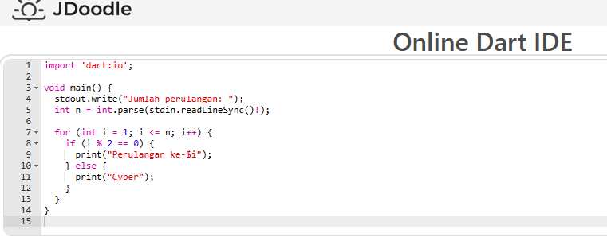
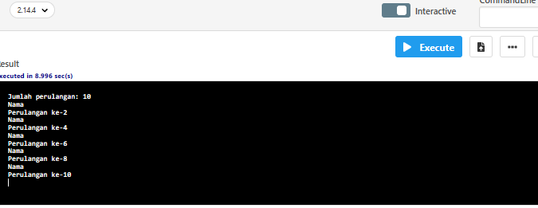

# Tugas Kodingan: Program Perulangan dengan Dart

Ini adalah tugas kodingan sederhana yang menggunakan bahasa pemrograman Dart. Program ini meminta pengguna untuk memasukkan jumlah perulangan, dan kemudian akan mencetak pesan "Perulangan ke-[nomor perulangan]" jika nomor perulangan tersebut adalah bilangan genap, dan mencetak pesan "Nama" jika nomor perulangan tersebut adalah bilangan ganjil.

## Cara Menjalankan Program

1. Pastikan Anda memiliki Dart SDK terinstal di komputer Anda.
2. Salin kode program yang terdapat dalam file `main.dart`.
3. Buka terminal atau command prompt dan arahkan ke direktori tempat Anda menyimpan file `main.dart`.
4. Jalankan perintah `dart main.dart` untuk menjalankan program.
5. Program akan meminta Anda untuk memasukkan jumlah perulangan.
6. Setelah memasukkan jumlah perulangan, program akan mencetak hasil sesuai dengan aturan yang telah ditentukan.

## Contoh Penggunaan

Output:

## Kontribusi

Kontribusi terbuka untuk perbaikan atau pengembangan lebih lanjut sangat diterima. Silakan buat *fork* dari repositori ini, lakukan perubahan yang diperlukan, dan ajukan *pull request* untuk ditinjau.

## Lisensi

Proyek ini dilisensikan di bawah [MIT License](LICENSE).
